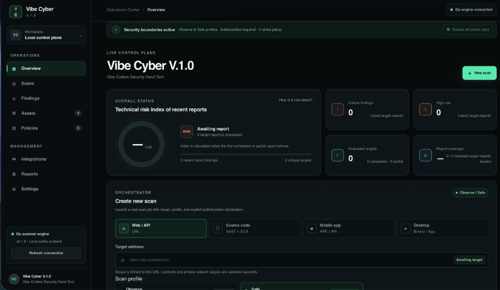

<div align="center">

  <h1>🛡️ Vibe Cyber V.1.0</h1>
  <p><strong>Vibe Coders Security Hand Tool & Unified Scanner Platform</strong></p>
  <p>An open-source, multi-target security scanner for Web / APIs, Source Code (SAST + SCA), Mobile Packages (APK/IPA), and Desktop Application Binaries.</p>

  <p>
    <a href="#-getting-started"></a>
    <a href="LICENSE"></a>
    <a href="https://go.dev/"></a>
    <a href="https://nextjs.org/"></a>
    <a href="https://www.electronjs.org/"></a>
  </p>

  <br />

  

  <br />
  <br />
</div>

> [!IMPORTANT]  
> **Authorized Testing Only:** Vibe Cyber is strictly engineered for targets you own or have explicit, documented permission to audit. Built-in `observe` and `safe` scan profiles enforce read-only execution, zero state-mutating requests, and strict sandbox safety.

---

## 🌟 Highlights & Key Features

Vibe Cyber unifies vulnerability management, code inspection, attack surface tracking, and compliance enforcement into a sleek, real-time control plane.

| Feature Module | Description & Capabilities |
| :--- | :--- |
| **▦ Operations Overview** | Technical risk index scoring, real-time status ring, and report coverage metrics across all active scan jobs. |
| **◎ Live Job Queue** | High-performance Go orchestrator with real-time Server-Sent Events (SSE) streaming and emergency single/all job cancellation controls. |
| **◇ Findings Matrix** | Severity-indexed vulnerability view with confidence classification, CWE/CVE metadata, and one-click remediation guidance. |
| **⌘ Asset Inventory** | Centralized Attack Surface Management (ASM) for monitoring web endpoints, local repository paths, mobile binaries, and desktop apps. |
| **⊡ Policy Engine** | Rule-based guardrails for OWASP Top 10, Secrets Leakage, SAST boundaries, SCA supply-chain SLAs, and custom path exclusion patterns. |
| **∞ Toolchain Integrations** | Native connection status for the local Go engine, GitHub/GitLab CI/CD webhooks, Slack/Discord alerts, and container scanners. |
| **≡ Executive Reports** | Comprehensive audit report generator with interactive Markdown (`Copy MD`) and structured JSON exports (`Export JSON`). |
| **⚙ Platform Settings** | Fine-grained configuration for daemon endpoints, max worker concurrency, profile defaults, and data retention windows. |

---

## 🎯 Supported Scan Targets

Vibe Cyber supports four primary attack surface targets with tailored analysis workflows:

- **◎ Web / API (`web`)**: Passive URL inspection, security headers, TLS parameters, CSP validation, and HTTP response analysis.
- **〈〉 Source Code (`source`)**: Static Application Security Testing (SAST) and Software Composition Analysis (SCA) for high-entropy secrets and vulnerability patterns.
- **▣ Mobile Apps (`mobile`)**: Sandboxed manifest and static analysis for Android APK and iOS IPA binary packages.
- **◈ Desktop Applications (`desktop`)**: Binary and configuration boundary scanning for `.app`, `.exe`, `.dmg`, `.bin`, and Electron shells.

---

## 🏗️ System Architecture

Vibe Cyber uses a decoupled architecture with strict security boundaries between the user interface and the scanner core:

```text
┌───────────────────────────┐      Same-Origin Proxy      ┌──────────────────────────────┐
│ Next.js Web Dashboard     │ ──────────────────────────> │ Loopback Go Control Daemon   │
│ (Cloudflare / Edge Ready) │ <────────────────────────── │ (127.0.0.1:7071 with Bearer) │
└───────────────────────────┘      SSE Live Streaming     └──────────────┬───────────────┘
                                                                         │
┌───────────────────────────┐      IPC Secure Bridge                     │ Bounded Queue
│ Electron Desktop Shell    │ ───────────────────────────────────────────┤
└───────────────────────────┘                                            ▼
┌───────────────────────────┐                               ┌──────────────────────────────┐
│ Standalone Go CLI         │ ────────────────────────────> │ Go Scanner Core Engine       │
└───────────────────────────┘                               └──────────────────────────────┘
```

- **Zero Client Credential Exposure**: The web dashboard never stores or handles raw API tokens directly; requests are authenticated via the same-origin web server proxy layer.
- **Sandbox Local Access**: Direct file system targets require explicit user authorization (`WEBCYBER_ALLOW_LOCAL=true`) or interactive Electron file picker selection.

For in-depth architecture and security model details, refer to [`docs/ARCHITECTURE.md`](docs/ARCHITECTURE.md) and [`docs/THREAT_MODEL.md`](docs/THREAT_MODEL.md).

---

## 🚀 Getting Started

### Prerequisites

Ensure you have the following installed:
- **Node.js**: `v22.13.0` or higher
- **Go**: `v1.24` or higher
- **npm**: `v10.0.0` or higher

### 1. Installation

Clone the repository and install dependencies:

```bash
git clone https://github.com/ilyasakkus/WebCyber.git
cd VibeCyber
npm install
```

### 2. Run Full Stack (Web Dashboard + Go Control Daemon)

Launch both the Next.js frontend and the Go control service simultaneously:

```bash
npm run dev:full
```

- **Web Control Plane**: `http://localhost:3000`
- **Go Control Service**: `http://127.0.0.1:7071` (automatically authenticated via generated Bearer token)

### 3. Run Go CLI Core Independently

You can execute scans directly from your terminal using the Go CLI:

```bash
# Run Go unit tests
npm run core:test

# Run passive observation scan on an authorized Web target
go run ./cmd/webcyber scan --type web --target https://example.com --profile observe --format sarif

# Run SAST scan on a local repository
go run ./cmd/webcyber scan --type source --target . --profile safe --format json
```

### 4. Desktop Electron Application

To build and run the native desktop application shell:

```bash
npm --prefix desktop install
npm --prefix desktop run prepare:scanner
npm --prefix desktop start
```

---

## 🛡️ Security Profiles

| Profile | Purpose & Scope | Execution Boundaries |
| :--- | :--- | :--- |
| `observe` | Metadata, TLS parameters, HTTP headers, and read-only static inspection. | Non-mutating, zero payload storage. |
| `safe` | Broad static code analysis, manifest inspection, and passive vulnerability checks. | Non-mutating, sandboxed execution. |
| `active` | Active DAST and staging environment vulnerability verification. | Restricted in Phase 1 (requires explicit tenant authorization). |

---

## 📂 Repository Structure

```text
├── app/                  # Next.js web dashboard & same-origin control proxy
├── cmd/
│   ├── webcyber/         # Go CLI scanner entrypoint
│   └── webcyberd/        # Go local control daemon
├── desktop/              # Electron desktop application shell & IPC bridge
├── docs/                 # Architecture, roadmap & threat model docs
│   └── images/           # Dashboard screenshots & media assets
├── internal/             # Scanner engine core, job queue, and built-in rules
├── public/               # Public assets & dashboard screenshots
├── schemas/              # Plugin manifest & SARIF contract definitions
└── scripts/              # Full-stack orchestrator scripts (dev-full.mjs)
```

---

## 🛣️ Roadmap & Future Scope

- [x] **Phase 1a**: Unified 8-module web interface, Go local control plane, SSE live streaming, and Electron desktop shell.
- [ ] **Phase 1b**: Multi-tenant persistent control daemon with SQLite/D1 database bindings.
- [ ] **Phase 2**: Worker adapter plugins for Semgrep, Trivy, Gitleaks, Nuclei, and MobSF.
- [ ] **Phase 3**: Signed worker binary verification and active staging DAST modules.

See [`docs/ROADMAP.md`](docs/ROADMAP.md) for detailed release milestones.

---

## 📄 License & Security

- **License**: Released under the [Apache-2.0 License](LICENSE).
- **Contributing**: Contributions are welcome! Please review [`CONTRIBUTING.md`](CONTRIBUTING.md).
- **Security Vulnerability Reporting**: For security disclosures, refer to [`SECURITY.md`](SECURITY.md).

<div align="center">
  <sub>Built with ❤️ by the Vibe Coders Security Team.</sub>
</div>
